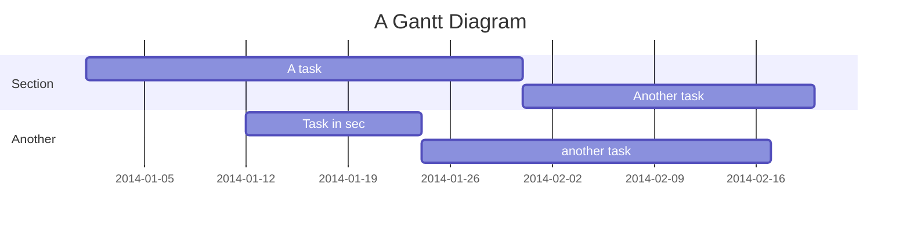

## 有効な見出し

##無効な見出し

---

HTMLの開始タグや終了タグ1に続けて空行を挟むことでHTML内でMarkdown記法が使えるようになります。

<details><summary>詳細はこちら</summary>

- リスト1
- リスト2
</details>

---

# これは h1 タグです
## これは h2 タグです
### これは h3 タグです
#### これは h4 タグです

---

-  リスト 1
-  リスト 2
    -  リスト 2a
         -  リスト 2a1
    -  リスト 2b

---

2. foo
1. bar
1. baz
    1. aaa
    1) bbb
    1. ccc

---

esa.io にはこのように書いてあります。

> esa.io は「情報を育てる」という視点で作られた、 
> 小さな開発チームのためのドキュメント共有サービスです。

---

それは私の**エサ**です。

---

それは~~いぬ~~トリのエサです。

---

インラインのコードは、`<code>` タグです。

---

```
$ git push origin master
```

---

```ruby
def esa
  puts "(\\( ⁰⊖⁰)/)"
end
```

---

```ruby:Gemfile
gem 'rails'
gem 'esa'
```

```ruby:tori.rb
puts '(\( ⁰⊖⁰)/)'
```

---

拡張子から言語を推論する

```index.ts
export const x = 1;
```

---

PHPは開始タグがなくてもハイライトされる

```php
echo 'PHP!';
```

---

```math
 e^{i \pi} = -1 
```

---

## PlantUML

```uml
Alice -> Bob: Authentication Request
Bob --> Alice: Authentication Response

Alice -> Bob: Another authentication Request
Alice <-- Bob: another authentication Response
```

## Mermaid



## Table

| アイテム名 | 値段 |
| --- | --- |
| いぬのえさ | 250円 |
| とりのえさ | 128円 |

セル内で改行したい場合は、`<br>` タグをご利用下さい。

| アイテム名 | 値段 |
| --- | --- |
| いぬの<br>えさ | 250円 |
| とりの<br>えさ | 128円 |

セル内はデフォルトは左寄せですが、ヘッダー行との区切りを`:---:` や `---:` のようにすると中央揃え、右寄せができます

| アイテム名 | 値段 | 備考 |
| --- | :---: | ---: | 
| いぬのえさ | 250円 | 税込み |
| とりのえさ | 128円 | 税込み |
| (左寄せ) | (中央揃え) | (右寄せ) |

列の幅を指定したい場合には、`<table>`タグをご利用下さい :pray: 

<table>
  <tr><th width="40">ID</th><th width="760">Item</th></tr>
  <tr><td>1</td><td>いぬのえさ</td></tr>
   <tr><td>1</td><td>いぬのえさ</td></tr>
</table>


## 折りたたみ

`<details>`タグをご利用いただくことで記事の一部を折りたたむことが可能です。中にMarkdownを記述する際には、空行を1つはさんで下さい。

<details><summary>詳細</summary>

- ここは折りたたまれる
    - foo
    - bar
</details>

## タスクリスト

- [ ] TODO
    - [ ] TODO
- [x] DONE


## 絵文字

`:emoji:` で、絵文字が表示できます。詳しくは[Emoji cheat sheet](http://www.emoji-cheat-sheet.com/) 参照下さい :sushi: :hatched_chick: :bird:
絵文字は投稿タイトルや見出しでも利用できます。チームに絵文字を追加する際には、「[カスタム絵文字が使えるようになりました](https://docs.esa.io/posts/226)」を参照下さい。

また、`:@USERNAME:`で、メンバーの絵文字が表示できます。

↓

:@ppworks: Hello

## メンション

@suin

@all

@unknown

## エスケープ

\# ほげ

\- hoge

\\hoge

(\\( ⁰⊖⁰)/)

## 脚注記法

脚注を付けたい場所にこのように書きます→ [^1]

[^1]: ここに脚注の内容を書きます


## コードブロック

```
何もなし
何もなし
<font color="red">ここは赤文字になってはならない</font>
```

```js
1 + 1
// js
// Lang
```

```html
<font color="red">ここは赤文字になってはならない</font>
```

```unknown
// unknown
// Lang
// 存在しない言語を指定
```

```foo.js
1 + 1
// foo.js
// Filename
// ファイル名から言語を推定
```

```ts:index.ts
1 + 1
// ts:index.ts
// Lang : Filename
// 言語指定とファイル名どちらも
```

```日本語.js
1 + 1
// 日本語.js
// Filename
// 日本語ファイル名
```

```java:日本語.java
1 + 1
// java:日本語.java
// Lang : Filename
// 言語指定と日本語ファイル名
```

```日本語:ファイル名
1 + 1
// 日本語:ファイル名
// Lang : Filename
```

```.zshrc
echo "1"
# .zshrc
# Filename
# 特殊なファイル名のみ
```

```abc foo bar
1 + 1
// js foo bar
// Text [ ] Text [ ] Text
// 半角スペース
```

```foo    bar   buz
1 + 1
// foo    bar   buz
// Text [ ][ ][ ] Text [ ] [ ][ ]Text
// 半角スペース
```

```php:foo bar
1 + 1
// php:foo bar
// Lang : Text [ ] Text
// 半角スペース
```

```php index.php
1 + 1
// php index.php
// Lang [ ] Filename
// 言語指定 space 文字
```

```php:a:
echo 1;
// php:a:
// Lang : Text :
```

```php:a:b
echo 1;
// php:a:b
// Lang : Text : Text
```

```[](#link)
1 + 1
// [](#link)
```

```js:[](#link)
1 + 1
// js:[](#link)
```

```"
1 + 1
// "
```

```<br><br>HTML<br><br>
1 + 1
// <br><br>HTML<br><br>
```

```js:<br><br>HTML<br><br>
1 + 1
// js:<br><br>HTML<br><br>
```

```~!@#$%^&*()_+{}[]|\\";'<>,./?
1 + 1
// ~!@#$%^&*()_+{}[]|\\";'<>,./?
```

```js:~!@#$%^&*()_+{}[]|\\";'<>,./?
1+1
// js:~!@#$%^&*()_+{}[]|\\";'<>,./?
```

```😌👨‍👩‍👦‍👦❄️
1+1
// 😌👨‍👩‍👦‍👦❄️
```

```js:😌👨‍👩‍👦‍👦❄️
1+1
// js:😌👨‍👩‍👦‍👦❄️
```

```😌👨‍👩‍👦‍👦❄️.js
1+1
// 😌👨‍👩‍👦‍👦❄️.js
// 絵文字.extension
```

---

# 見出し1

## 見出し2

### 見出し3

#### 見出し4

##### 見出し5

###### 見出し6

####### 見出し7

# :sushi: 絵文字 :beer: 

# `code`

# **strong**

# *italic*

# ~~strike~~

# see [link](http://localhost)

# HTML <div>DIV</div>
